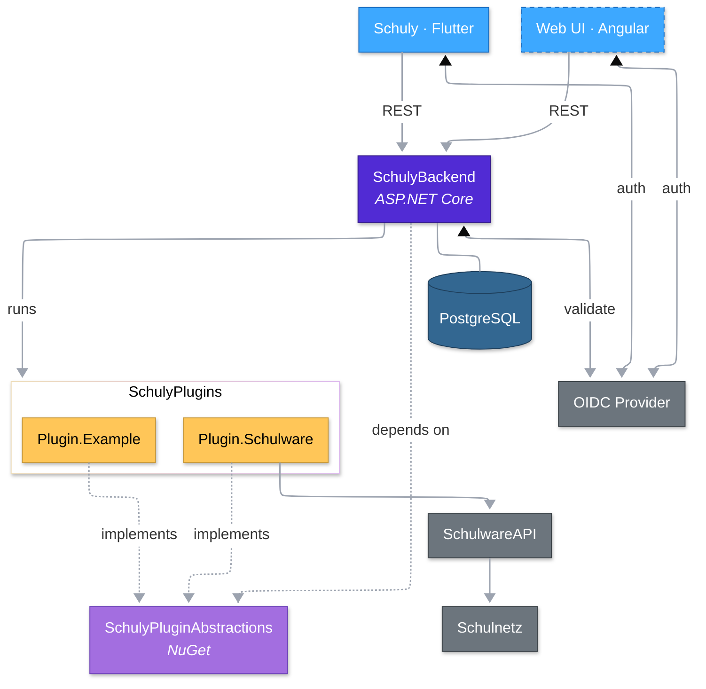

  

<h1 align="center">Schuly</h1>

  <strong>The better Schulnetz app — open-source, mobile-first, extensible.</strong>

  
  
  

---

## What is Schuly?

A modern, mobile-first alternative to the official Schulnetz client — built around a clean Flutter UI, a clean-architecture C# backend, and a plugin runtime that lets new school systems plug in without touching the core.

> Schuly is **NOT** affiliated with, endorsed by, or connected to Schulnetz or Centerboard AG.

## Repositories

| Repo | Stack | Purpose |
|---|---|---|
| [**Schuly**](https://github.com/schulydev/Schuly) | Flutter / Dart | The mobile app — iOS + Android |
| [**SchulyBackend**](https://github.com/schulydev/SchulyBackend) | C# / ASP.NET Core | API + domain logic + plugin host |
| [**SchulyPluginAbstractions**](https://github.com/schulydev/SchulyPluginAbstractions) | C# / NuGet | Stable plugin contract — implement this to write a plugin |
| [**SchulyPlugins**](https://github.com/schulydev/SchulyPlugins) | C# | Official plugins (Schulware, Example, ...) |
| [**SchulyWebsite**](https://github.com/schulydev/SchulyWebsite) | Angular | Landing site at [schuly.dev](https://schuly.dev) |

## Architecture at a glance

## Want to contribute?

- 🐛 Bugs → open an issue in the affected repo with the `bug` label
- ✨ Features → open an issue with `feature` or `enhancement`
- 🧩 New plugin → see [SchulyPlugins](https://github.com/schulydev/SchulyPlugins) and the [PluginAbstractions](https://github.com/schulydev/SchulyPluginAbstractions) contract

Every repo follows the same workflow: open an issue with a label, branch as `feature/<#>_PascalCase` or `fix/<#>_PascalCase`, open a PR, squash-merge.
